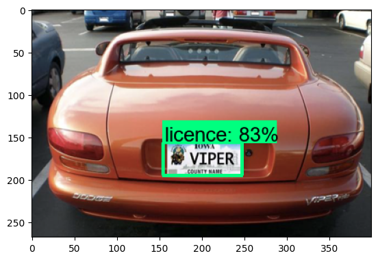

# Automatic Number Plate Recognition In Real Time 
Perform Number Plate Recognition with the TensorFlow Object Detection API and a PyTorch OCR model for detecting the text in the plate. With real time through the webcam the results are going to be saved in realtimeresults.csv

The training dataset is from Kaggle: https://www.kaggle.com/datasets/andrewmvd/car-plate-detection

## Steps
 
<b>Step 1.</b> Clone this repository
<pre>
git clone https://github.com/schehat/automatic_number_plate_recognition
</pre>
  
<b>Step 2.</b> Create a new virtual environment 
<pre>
python -m venv anpr
</pre> 
 
<b>Step 3.</b> Activate your virtual environment
<pre>
.\anpr\Scripts\activate # Windows 
</pre>
 
<b>Step 4.</b> Install dependencies and add virtual environment to kernel
<pre>
pip install -r /path/to/requirements.txt
python -m ipykernel install --user --name=anpr
</pre>
 